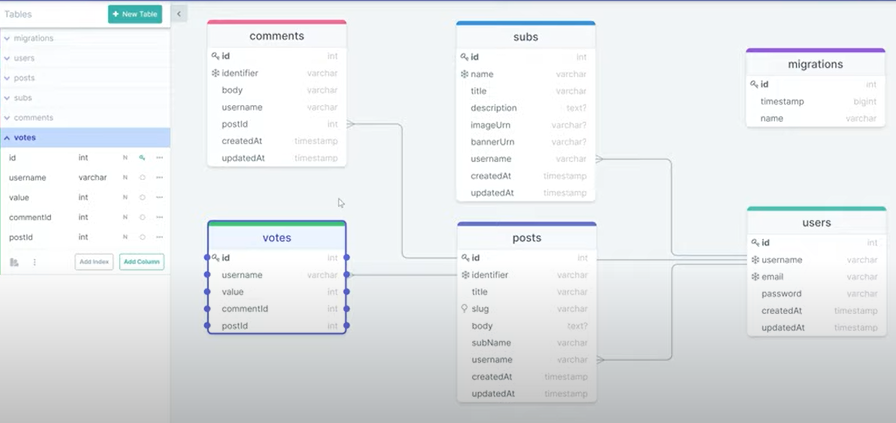
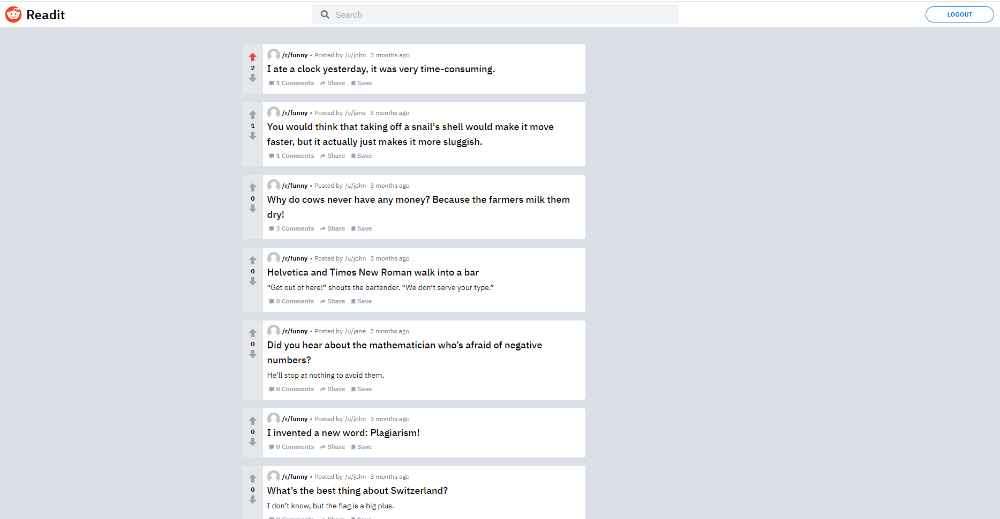

### READit app (full stack app)

postgresql, typeScript, TailwindCSS, TypeORM, nextjs

Backend: port=5000 and run the command: (front end 3000) and this command will run both

```
npm run dev
```

### some commands for backend (api)

https://typeorm.io/#/using-cli

- npm i -g typeorm
- typeorm init --database postgres
- npm i ts-node@latest @types/node@latest typescript@latest
- check tsconfig file, adding stuff
- npm i -D @types/bcrypt
- npm i class-transformer // postman hide password and id
- class-validate in entities/User.ts

  <br>
  

  <br>

- typeorm entity:create --name Post (create new entity)
- https://typeorm.io/#/using-cli ("typeorm": "ts-node ./node_modules/typeorm/cli.js")
- npm run typeorm schema:drop
- npm run typeorm migration:generate -- --name create-users-table (generate migration folder)
- npm run typeorm migration:run
- npm run seed
- swr : react hooks for data fetching

  <br>
  database structure:
  

<br>
https://icomoon.io/app/#/select  icon moon


