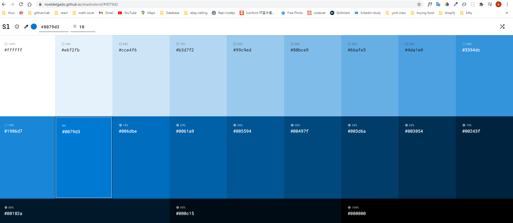

### Frontend of reddit app clone

```bash
npm run dev
# or
yarn dev
```

Open [http://localhost:3000](http://localhost:3000) with your browser to see the result.

css shadowlord link: https://noeldelgado.github.io/shadowlord/#a41771 (generate multi color pattern)
<br>



<br>

reference link: https://github.com/hidjou/classsed-reddit-clone

**some commands and highlights:**

- npm install --save-dev typescript @types/react
- npm run dev will generate content of tsconfig.json
- how to show validation in register page (register.tsx) by using "classnames"
